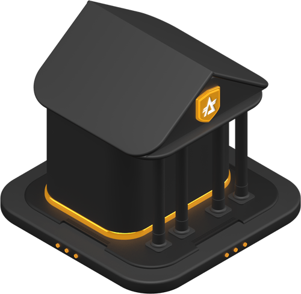
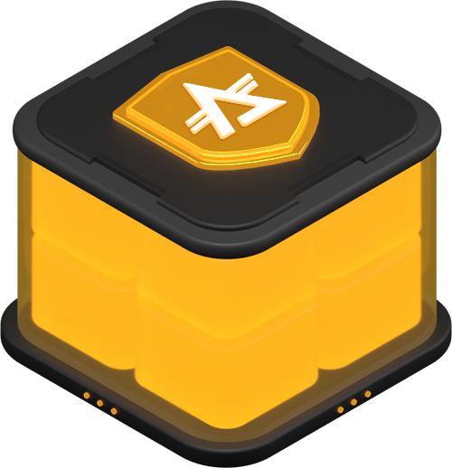

<h2 align="center">
  Send, Stake and Receive with ADONIS's most universal wallet.
</h2>

  <a href="https://wallet.adonis.exchange/">Production</a> (Stable) 

---

 

## Be your own Bank

AWW is a completely [non-custodial](https://www.bitcoin.com/get-started/custodial-non-custodial-bitcoin-wallets/), client-side system, giving you absolute control over your funds, data, bandwidth and privacy... all of which are essential to easily-attainable **self-sovereignty**.

 

---

 

## Universal and Portable

AWW is completely universal and portable, at both a user-experience level & protocol-level, AWW is interopable with much of the functionality within ADONIS, while also being portable enough to run on almost **any device in the world**.

 

---

 

## Don't trust, Verify!

AWW is completely free, open-source software ([FOSS](https://en.wikipedia.org/wiki/Free_and_open-source_software)), with absolute transparency in security, features, down to every letter of code. 
Alongside total codebase availability, AWW allows you to totally bunker-down, with the ability to customize your experience in accordance to your [principles](https://en.wikipedia.org/wiki/Free_and_open-source_software#Four_essential_freedoms_of_Free_Software) & security desires.

 

---

 

## By the Community, for the Community

AWW is built with love by [Adonis Network](https://github.com/adonisexchange), a micro-DAO of [awesome people](https://github.com/adonisexchange/Adon-Web-Wallet/graphs/contributors) that build both FOSS and Proprietary software for the ADONIS community to enjoy.

The mission of Adonis Network is to accelerate the adoption & growth of ADONIS as a currency, using awesomeness. Join the [Adonis Network Discord](https://discord.adonis.network) to meet us!

 

---
